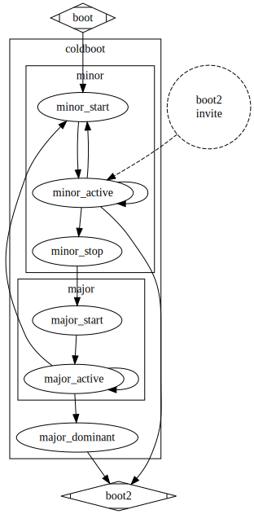

# [ **Preliminary** ]

# **Coldboot**

The goal of **coldboot** is to produce and maintain an ordered bus. 

An **ordered bus** means the bus which is running with ordered ownership of the **token**.  

The **token** is effectively a **mutex**, granting exclusive access to the bus.

The **coldboot** state of a node may be entered while the bus ordered or disordered.

The **coldboot** state machine must determine the state of the bus and transition the node onto the bus according to the current bus state.

The **coldboot** state machine is divided into two major function blocks, **coldboot minor**, and **coldboot major**.

## **Coldboot Minor**

When a node initially enters the **coldboot** state, the overall state of the bus is unknown to the node.

The node will transition initially into a **coldboot minor** state.

In the **coldboot minor** state, the node will only listen to traffic for some time, in particular, listening for the **token** which indicates that an **ordered bus** is in-progress already.

If, after sufficient time, there is no sign of a **token**, and/or there are other **coldboot** packets are in progress, then the node transitions to **coldboot major** state.

If, there is an **ordered bus** detected, then the node will wait silently, until invited to respond with a **warm boot** invitation broadcast.

## **Coldboot Major**

The function of **coldboot major** is to determine which node is the so called **dominant node**.

The node which emerges from **cold boot** as the **dominant node** is the node which holds the **token** 

How is the **dominant node** determined? 

Once a node transitions to **coldboot major** state, it will begin broadcasting it's identity and listening for other identities.

When the node detects the presence of a more dominant node, it then reverts to the dormant **coldboot minor** state.

Once all other nodes have gone dormant, the remaining node becomes dominant, seizing control of the **token**.

## **Coldboot State Diagram**

## **boot2**

The function of **boot2** is to establish identification and order on the bus.

The **dominant node** will have acquired the **token**. 

While the **dominant node** is holding the **token**, it will begin to broadcast requests for identification.

Nodes will respond to these broadcasts at random intervals within a bounded window of time.

## **boot2 State Diagram**

